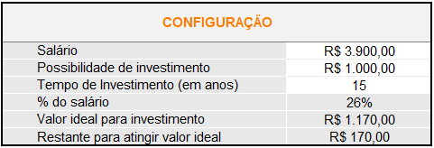
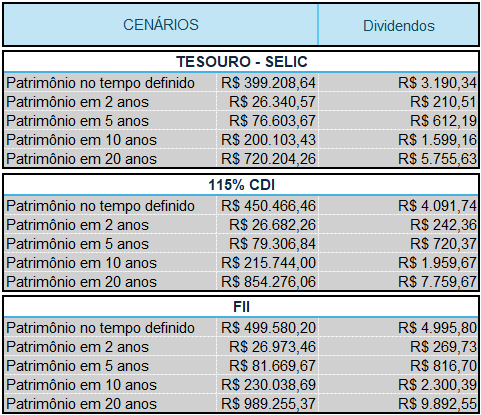
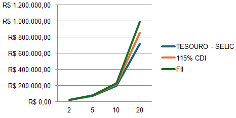

# Simulador de Investimentos (Excel)

## 📌 Descrição do Projeto

Este projeto consiste no desenvolvimento de uma ferramenta simples em **Excel** para simulação de investimentos de forma geral.  
A planilha permite calcular de forma automatizada o **valor total investido**, o **patrimônio acumulado ao longo do tempo** e os **rendimentos mensais**, contemplando diferentes tipos de investimentos — incluindo **fundos imobiliários**.

O objetivo é oferecer uma solução prática, acessível e didática, voltada principalmente para **investidores iniciantes**, servindo também como base para futuras expansões e personalizações.

---

## 🎯 Objetivos de Aprendizagem

Com o desenvolvimento deste projeto, foi possível:

- Aplicar conceitos de Excel na criação de uma ferramenta prática;
- Utilizar cálculos financeiros para simulação de investimentos;
- Automatizar o cálculo de dividendos mensais e patrimônio acumulado;
- Estruturar e documentar um projeto técnico de forma clara;
- Utilizar o GitHub como ferramenta de versionamento e compartilhamento de documentação.

---

## 📊 Funcionalidades da Planilha

A planilha permite ao usuário:

- Definir o **valor do investimento inicial**;
- Informar **aportes mensais**;
- Determinar o **período de investimento**;
- Visualizar:
  - Valor total investido;
  - Patrimônio acumulado ao longo do tempo;
  - Estimativa de dividendos mensais;
- Comparação gráfica entre três cenários de investimento, incluindo fundos imobiliários.

Todos os cálculos são realizados automaticamente, facilitando a análise e a tomada de decisão.

---

## 🛠️ Tecnologias Utilizadas

- **Microsoft Excel**
  - Fórmulas financeiras
  - Referências entre células
  - Organização lógica de dados

- **GitHub**
  - Versionamento do projeto
  - Compartilhamento da documentação técnica

---

## 📁 Estrutura do Repositório
```
├── README.md  
├── Simulador_Investimentos.xlsx  
└── images/  
    ├── config.png  
    ├── projecoes.png  
    └── grafico.png  
```
A pasta `images` contém capturas de tela da planilha para demonstrar a configuração, projeção e visualização gráfica dos resultados.

---

## 📸 Visão Geral da Planilha

### Configuração do Investimento


### Projeção de Investimentos


### Gráfico de Evolução


---

## ▶️ Como Utilizar

1. Faça o download do arquivo Excel disponível neste repositório;
2. Abra o arquivo no Microsoft Excel ou software compatível;
3. Preencha os campos de investimento conforme desejado;
4. Analise automaticamente os resultados gerados pela planilha.

---

## 🧠 Aprendizados

Este desafio permitiu consolidar conhecimentos tanto em Excel quanto em GitHub, reforçando a importância da documentação clara e da organização de projetos técnicos para compartilhamento e colaboração.

---

## 📌 Projeto desenvolvido como parte do curso da DIO

Projeto desenvolvido como parte de um desafio prático da **Digital Innovation One (DIO)**, com foco na aplicação de conceitos de Excel e no uso do GitHub para entrega e documentação de projetos.
